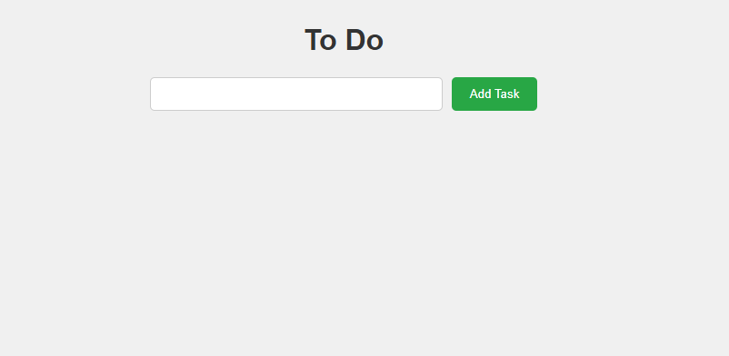
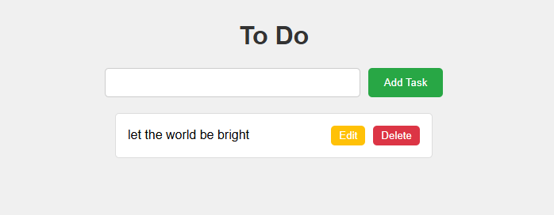
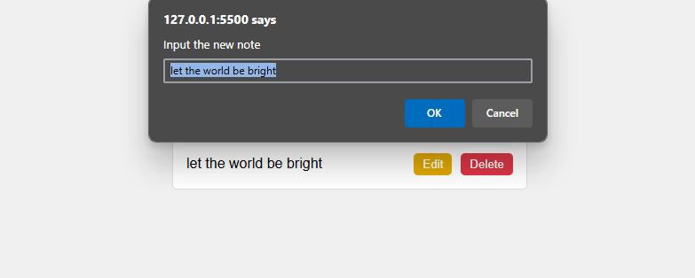

# A2SV_PROJECT_PHASE_TO_DO_LIST

A to do list application with TypeScript.

# Features

1. Add Tasks
2. Edit Tasks
3. Delete Tasks

# How To run

`git clone  <repo url>`
open the index.html on your browser
